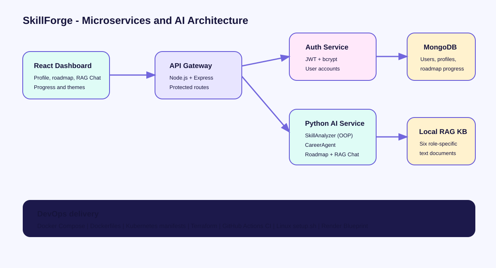

# SkillForge

**AI-powered career intelligence for students.** SkillForge compares a student's current skills with a chosen tech career, retrieves role-specific learning guidance, and produces a grounded, trackable roadmap.

## Architecture



The application uses a microservices design:

- **React + Nginx frontend:** account creation, profile form, roadmap, RAG chat, progress, and light/dark interface.
- **Node.js API Gateway:** protected profile routes and service routing.
- **Node.js Auth Service:** bcrypt password hashing and JWT sessions.
- **Python AI Service:** OOP `SkillAnalyzer` and `CareerAgent`.
- **MongoDB:** student profiles, saved roadmaps, and completed steps.
- **Local RAG knowledge base:** six role-specific documents grounding roadmaps and chat.

## Required AI components

| Requirement | Implementation |
| --- | --- |
| Python + OOP | `python-service/skill_analyzer.py` provides the class-based `SkillAnalyzer` |
| GenAI | `CareerAgent` uses the OpenAI Responses API when an API key is configured |
| RAG | `rag/retriever.py` retrieves local role-specific `.txt` documents |
| Agentic AI | `CareerAgent` explicitly invokes skill-analysis and RAG-retrieval tools |

The free local mode remains fully functional without an API key: it creates personalized role-specific roadmaps from skill analysis and retrieved local guidance.

## Required web components

- React dashboard in `frontend/`
- Node.js API Gateway in `backend/api-gateway/`
- Separate Node.js Auth Service in `backend/auth-service/`
- MongoDB database

## Required DevOps components

- Linux setup script: `scripts/setup.sh`
- Docker: `docker-compose.yml` and service Dockerfiles
- Kubernetes: `kubernetes/skillforge-stack.yaml`
- Terraform: `terraform/`
- CI: `.github/workflows/ci.yml`
- Render deployment Blueprint: `render.yaml`

## Run locally

```bash
cp .env.example .env
docker compose up --build
```

Open `http://localhost:8080`.

On Windows PowerShell:

```powershell
Copy-Item .env.example .env
docker compose up --build
```

`OPENAI_API_KEY` is optional. Leave it blank to use the free local RAG mode. Never commit a real `.env` file.

## Quick verification

```bash
python python-service/test_skill_analyzer.py
docker compose config --quiet
```

Supported target roles: AI Engineer, Web Developer, Data Analyst, Data Scientist, Cybersecurity Analyst, and Mobile Developer.

## Hackathon demo flow

1. Create an account.
2. Enter the student's profile, target role, and current skills.
3. Generate the role-weighted skill assessment and roadmap.
4. Show RAG Chat and its returned source files.
5. Mark a roadmap item complete and show persisted progress.
6. Show Docker Compose, Kubernetes manifests, Terraform, and GitHub Actions CI.

## Submission pack

Use these links for the hackathon submission form:

- [Architecture diagram](docs/architecture.svg)
- [Database / schema explanation](docs/database-schema.md)
- [API documentation](docs/api-documentation.md)
- [AI / agent explanation](docs/ai-agent-explanation.md)
- [Presentation outline](docs/presentation-outline.md)
- [Environment template](.env.example)
- [Docker configuration](docker-compose.yml)
- [Kubernetes manifests](kubernetes/skillforge-stack.yaml)
- [Terraform files](terraform/)
- [Linux shell script](scripts/setup.sh)
- [RAG knowledge-base files](rag/knowledge-base/)

## Security notes

Passwords are hashed with bcrypt. API sessions are JWT-based, auth routes are rate-limited, and profile routes enforce ownership by authenticated user ID. Configure a long unique `JWT_SECRET` for public deployments.
